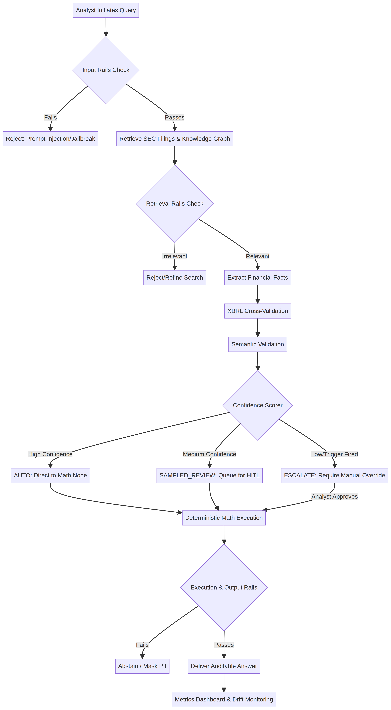

# Key Business Process Maps: RAG Workbench

## Overview

To successfully deploy the RAG Workbench within a banking environment, we must map how the system integrates into existing workflows. These process maps illustrate the end-to-end journey of a financial query, highlighting the integration of NeMo Guardrails, Human-in-the-Loop (HITL) review, and deterministic validation.

## Core Process: Auditable Financial Analysis

This workflow represents the primary path for a financial analyst querying the system for credit assessment or risk analysis.

### Process Steps

**1. Query Initiation and Input Validation**
The analyst submits a natural language query (e.g., "Calculate the operating margin for Apple based on their latest 10-K"). The system immediately applies Input and Dialog Rails to detect prompt injections, jailbreak attempts, or off-topic requests. If the query fails these checks, it is rejected; otherwise, it proceeds to retrieval.

**2. Retrieval and Relevance Filtering**
The system retrieves relevant chunks from SEC EDGAR filings and structured entities from the DuckDB knowledge graph. Retrieval Rails evaluate the context against the query, discarding irrelevant information to ensure the LLM operates only on pertinent data.

**3. Extraction and Multi-Layer Validation**
The LLM extracts specific financial figures, which are then subjected to two layers of validation:
- **Layer 1 (Schema Validator):** Checks field presence, data types, and unit sanity (e.g., ensuring values are correctly scaled in thousands or millions).
- **Layer 2 (Semantic & XBRL Validator):** Cross-references extracted figures against authoritative XBRL data and verifies accounting identities (e.g., Assets = Liabilities + Equity).

**4. Confidence Scoring and Routing**
A deterministic scorer evaluates the extraction provenance and validation results to assign a confidence tier:
- **AUTO (High Confidence):** Proceeds directly to execution.
- **SAMPLED_REVIEW (Medium Confidence):** Proceeds to execution but is queued for asynchronous human review to monitor system drift.
- **ESCALATE (Low Confidence or Trigger Fired):** Halts execution until a human analyst manually reviews and overrides the extraction.

**5. Deterministic Execution and Output Verification**
Extracted data is passed to a Python-based Math Node for deterministic calculation, avoiding LLM math hallucinations. Output Rails perform final checks for PII leakage and system prompt exposure before delivering the auditable answer, complete with provenance tags, to the analyst.

## Supporting Process: Model Risk Monitoring (SR 26-2 Compliance)

This workflow supports the compliance and governance teams responsible for overseeing model risk management.

### Process Steps

**1. Data Aggregation**
As the core process operates, all routing decisions, validation results, and HITL feedback are logged into the review database.

**2. Drift Detection**
The system continuously calculates the rolling agreement rate between automated extractions and XBRL ground truth (or human feedback). If this rate drops below the configured floor (e.g., 95%), or if the volume of unrecognized concepts spikes, the system triggers a drift alert.

**3. Dashboard Review**
Model Risk Management (MRM) teams monitor the Metrics Dashboard, reviewing the distribution of AUTO, SAMPLED_REVIEW, and ESCALATE routes to ensure the system is operating within approved risk tolerances.

**4. Calibration**
Periodically, the shadow deployment script is run over historical filings to generate new calibration data. MRM teams use this data to adjust the threshold cut-points for routing, ensuring the system remains optimized for both efficiency and accuracy.
