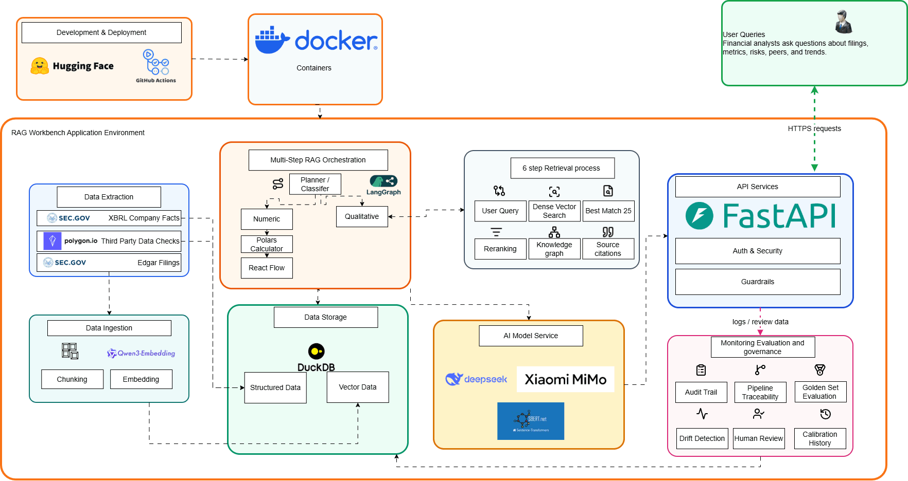

# RAG Workbench

**Enterprise-grade Retrieval-Augmented Generation platform for regulated financial environments.**

RAG Workbench is a financial AI platform for SEC filing analysis where answers are not just generated, but retrieved, verified, routed, and auditable. It combines hybrid retrieval, knowledge-graph evidence, XBRL validation, deterministic financial calculations, guardrails, human review, drift monitoring, and lineage logging in a single deployable system.

The project is built to communicate how enterprise AI systems should behave in regulated domains: every material claim needs evidence, every number needs a source of truth, and every high-risk answer needs an operational control path.

## Architecture



The system separates deployment, runtime inference, data ingestion, model providers, API services, and governance. User queries enter through FastAPI; retrieval and orchestration operate inside the application boundary; LLM providers remain external; and audit, evaluation, review, drift, and calibration are treated as first-class product surfaces rather than afterthoughts.

Editable diagram source files are kept in `docs/*.drawio`.

---

## Why this project exists

Analysts reviewing SEC filings need speed, but regulated financial institutions also need evidence, repeatability, and model-risk controls. Traditional black-box LLM workflows fail that bar because they cannot reliably show where an answer came from, whether the numbers reconcile, or which outputs need human review.

This project treats filing analysis as an enterprise AI workflow, not a chatbot demo. The target workflow is SEC filing review: analysts search long documents, validate figures, compare peers, identify risk language, and turn findings into credit, research, compliance, or relationship-management commentary.

The product outcome is **time saved without losing auditability**:

| Outcome | Target behavior |
|---|---|
| Productivity | Reduce routine filing lookup from analyst minutes to a cited answer in seconds |
| Quality | Require source citations, XBRL grounding, and calculation steps for numeric claims |
| Governance | Preserve run logs, sources, model versions, confidence scores, and reviewer decisions |
| Compliance | Support independent review through audit endpoints and evidence panels |
| Adoption | Make the answer useful to compliance, research, credit, and relationship-management users |

The same traceability spine serves four banking users:

| Persona | Job to be done | What the system must prove |
|---|---|---|
| Compliance officer | Audit an AI-generated answer after deployment | Every claim has source evidence, confidence, and a review trail |
| Equity research analyst | Find relevant filing disclosures under deadline | Fast retrieval with exact citations and comparable historical context |
| Credit analyst | Validate borrower figures and risk signals | Numeric accuracy, XBRL checks, and defensible calculations |
| Relationship manager | Prepare for client conversations | Clear summaries, key risks, and source-backed talking points |

---

## Enterprise capabilities

| Capability | What it demonstrates |
|---|---|
| Multi-agent orchestration | LangGraph routes questions through retrieval, classification, extraction, calculation, verification, output, abstention, and lineage nodes |
| Hybrid RAG | Dense embeddings, BM25 keyword search, Reciprocal Rank Fusion, and cross-encoder reranking |
| Knowledge graph | Extracted filing triples support entity, relationship, peer, and evidence exploration |
| XBRL verification | Numeric claims are checked against structured SEC facts where available |
| Deterministic financial calculations | Python calculates margins, ratios, growth, FCF, CAGR, and accounting identities |
| Guardrails | Input, dialog, retrieval, execution, and output rails constrain unsafe or off-topic behavior |
| Human review | `AUTO`, `SAMPLED_REVIEW`, and `ESCALATE` routing creates an oversight loop |
| Drift detection | Agreement-rate and concept-spike monitoring surface degradation risks |
| Audit trail | Run IDs, source chunks, EDGAR links, XBRL facts, formulas, confidence, and review history are preserved |

Most RAG systems retrieve context and trust the LLM to do the rest. RAG Workbench splits the work along trust lines:

- **AI retrieves and explains.** A LangGraph pipeline finds the right SEC filing chunks and XBRL-tagged facts, then writes the prose.
- **Python calculates.** `financial_calc.py` does all arithmetic — the LLM is never asked to do math.
- **XBRL verifies.** Every numeric answer is cross-checked against the SEC EDGAR companyfacts API before it's returned, with an independent NLI model checking that the prose is entailed by the sources.
- **The pipeline can abstain.** If verification fails or no GAAP-equivalent fact exists, the system declines rather than guesses.
- **The audit trail is the product.** Each answer shows retrieved chunks with EDGAR links, the XBRL fact behind each number, the formula used, a green/red verification badge, and full lineage.

---

## Technical architecture

Single Docker container (Nginx + Uvicorn + Supervisor), deployed to Hugging Face Spaces.

```
Browser
  │
  └── Nginx (port 7860)
        ├── /* ──────────────────── React + Vite + Tailwind (static build)
        └── /api/* ──────────────── FastAPI (port 8000)
```

The flagship answer path is the **auditable RAG** LangGraph DAG (`POST /api/chat/auditable-rag`):

```
                          retrieval (dense + BM25 + rerank)
                                   │
                              classifier ── numeric vs qualitative?
                          ┌────────┴─────────────┐
               numeric    │                      │   qualitative
                          ▼                      ▼
                     extraction            qualitative_output
                  (SEC companyfacts)      (LLM over retrieved docs)
                          │                      │
                       eval (validation layer)   │
                          │                      │
                        math (financial_calc.py) │
                          │                      │
                     verification                │
                  (numeric XBRL + NLI entailment)│
                   ┌──────┴──────┐               │
                   ▼             ▼               │
                output       abstention          │
                   └──────┬──────┴───────────────┘
                          ▼
                    build_lineage
                          │
                          ▼
   { answer, sources, xbrl_facts, relevant_xbrl, verification badge,
     math_steps, what_it_means, follow_ups, confidence, lineage, chart }
```

Every request additionally passes through **guardrails** — input rails (injection / safety), dialog rails (on-topic enforcement) before the pipeline, and output rails (PII masking) on the response.

Alternative answer paths share the same retrieval and audit layer:
- **`/api/chat/graph-rag`** — knowledge-graph retrieval over extracted filing triples.
- **`/api/chat/rag`** — plain hybrid RAG (no math/verify spine).
- **`/api/chat/sql`** — natural language → DuckDB query.

---

## Control model

The system is designed around six validation layers:

| Layer | Objective | Risk mitigated |
|---|---|---|
| Schema and formatting | Validate types, CIK/accession formats, and scale conventions | Pipeline crashes and obvious numeric scale errors |
| Semantic integrity | Enforce accounting identities and financial logic checks | Mathematically impossible statements |
| XBRL cross-validation | Compare extracted facts to SEC companyfacts / XBRL source data | Hallucinated or stale numeric claims |
| Numeric NLI verification | Check that prose claims are entailed by retrieved evidence | Plausible narratives around unsupported numbers |
| External cross-checks | Optional market/entity checks such as Polygon and auditor/entity recognition | Wrong corporate context or stale external data |
| Confidence routing | Route outputs into auto, sampled review, or escalation | High-risk answers bypassing human oversight |

Every run also passes through five operational checkpoints:

1. **Provenance tagging:** extracted fields carry a source category such as XBRL, structured table, or narrative evidence.
2. **Lineage node:** the final LangGraph node records run ID, source chunks, model versions, confidence, timestamps, and routing.
3. **Audit persistence:** `audit_runs`, `review_decisions`, and calibration tables preserve the workflow history in DuckDB.
4. **Source attribution:** API responses include EDGAR URLs, chunk metadata, XBRL facts, formulas, and graph evidence where applicable.
5. **API visibility:** `/api/audit` and review endpoints expose the audit trail for dashboards and independent oversight.

---

## Implementation details

### Backend — `api/`

**Orchestration & retrieval**

| File | What it does |
|---|---|
| `services/langgraph_engine.py` | The auditable DAG: retrieval → classifier → extraction → eval → math → verification → output/abstain → lineage |
| `services/graph_rag_engine.py` | Graph RAG: entity search + triple extraction over the knowledge graph |
| `services/rag_engine.py` | Hybrid retrieval: dense embeddings + BM25, RRF merge |
| `services/hybrid_retriever.py` | Dense + sparse fusion retriever |
| `services/reranker.py` | CrossEncoder reranking of retrieved chunks (`ms-marco-MiniLM-L-6-v2`) |
| `services/metric_router.py` | Routes a question to the right metric / calculator |
| `services/chat_engine.py` | SQL mode — natural language to DuckDB queries |
| `services/embeddings.py` | Embedding provider abstraction (local sentence-transformers default) |

**Calculation & verification spine**

| File | What it does |
|---|---|
| `services/financial_calc.py` | All financial arithmetic (margins, FCF, CAGR, ratios, accounting-identity checks) — the LLM never does math |
| `services/xbrl_client.py` | SEC EDGAR companyfacts API client — rate-limited (≤10 req/s), LRU-cached |
| `services/sec_client.py` | EdgarTools + Polars XBRL extraction, LRU-cached per ticker |
| `services/edgar_adapter.py` | Wraps EdgarTools output into the canonical `ExtractionResult` type contract |
| `services/verification.py` | Numeric claim extraction + XBRL cross-check (1% tolerance) |
| `services/verifier.py` | NLI CrossEncoder entailment check — independent model from the generator |
| `services/xbrl_cross_validator.py` | Cross-validates extracted facts across filings/frames |
| `services/polygon_verifier.py` | Optional market-data cross-check via Polygon |
| `services/confidence_scorer.py` | Per-answer confidence scoring feeding the routing decision |
| `services/schema_validator.py` / `semantic_validator.py` | Structural + semantic validation of extracted facts |

**Guardrails — `services/guardrails/`**

| File | What it does |
|---|---|
| `input_rails.py` | Blocks prompt injection / unsafe input |
| `dialog_rails.py` | Refuses off-topic (non-filing) questions |
| `output_rails.py` | Masks PII before returning the answer |
| `retrieval_rails.py` / `execution_rails.py` | Retrieval-grounding and execution-safety checks |

**Qualitative analysis**

| File | What it does |
|---|---|
| `services/sentiment.py` | Loughran-McDonald lexicon sentiment/tone scoring (dict in `data/sentiment_dict/`) |
| `services/sec_analyzer.py` | Section-level filing analysis |
| `services/peer_comparison.py` | Cross-company peer comparison |
| `services/chart_tool.py` | Builds chart specs returned to the frontend |

**Governance & ops**

| File | What it does |
|---|---|
| `services/drift_detection.py` | Agreement-rate and concept-spike drift alerts |
| `services/calibration.py` | Routing-threshold recalibration from reviewer verdicts |
| `services/shadow_runner.py` | Shadow-deployment runner for offline comparison |
| `services/runtime_snapshot.py` | Parquet snapshot of the runtime/review DB to the HF dataset |
| `services/llm_health.py` | LLM call success/failure telemetry |
| `db/database.py` / `db/review_queue.py` | DuckDB access (main corpus + review/audit DB) |

### API surface

| Router | Endpoints |
|---|---|
| `routes/chat.py` | `POST /api/chat/{sql,rag,graph-rag,auditable-rag,sec-analyzer,feedback}` |
| `routes/review.py` | `GET /api/review/{queue,metrics,drift}`, `POST /api/review/{queue,decisions/{id}/verdict,calibrate}` |
| `routes/graph.py` | `GET /api/graph/{analytics,triples,evidence}` |
| `routes/sentiment.py` | `GET /api/sentiment/{ticker}`, `/{ticker}/{compare,history,tone-shift}` |
| `routes/audit.py` | `GET /api/audit`, `/api/audit/{run_id}`, `/api/audit/summary/stats` |
| `routes/analytics.py` | `POST /api/analytics/track`, `GET /api/analytics/{summary,posthog}` |
| `routes/admin.py` | `POST /api/admin/{refresh-data,snapshot,embed-data}` |
| `routes/stats.py` | `GET /api/stats` |
| `main.py` | `GET /api/health`, `/api/health/full` (DB + drift + LLM telemetry) |

### Frontend — `frontend/src/`

React + TypeScript + Vite + Tailwind. Routed shell: `/` portfolio home, `/rag-overview`, `/rag/*` workbench.

| Area | Files |
|---|---|
| Views | `views/ChatView.tsx` (SQL / RAG / auditable / graph chat), `views/TraceabilityView.tsx` |
| Audit & pipeline | `components/AuditTrail.tsx` (sources + XBRL facts table + verification badge), `components/PipelineFlow.tsx` (live step viz), `components/DriftAlert.tsx` |
| Knowledge graph | `components/KnowledgeGraph.tsx`, `GraphExplorer.tsx`, `GraphAnalytics.tsx` |
| Charts & tone | `components/FinancialChart.tsx`, `ChartView.tsx`, `ToneAnalysis.tsx` |
| Pages | `pages/ReviewQueue.tsx`, `MetricsDashboard.tsx`, `SystemDashboard.tsx`, `AuditLog.tsx`, `Methodology.tsx`, `ProductAnalytics.tsx`, `PortfolioHome.tsx`, `RagOverview.tsx`, `StocksList.tsx` |
| API clients | `api/{client,chat,review,graph,analytics}.ts` |

### Evaluation — `evals/`

| File | What it does |
|---|---|
| `golden_set.csv` | 50 labelled semiconductor questions across 8 failure modes |
| `run_eval.py` | Deterministic 4-axis scorer: correctness, XBRL verified, has sources, abstention |
| `ragas_eval.py` | LLM-judge metrics: faithfulness, answer relevancy, context precision/recall |

---

## Quickstart

### Prerequisites

- Python 3.11+ (the Docker image pins 3.11)
- Node 22+
- Docker (for the container build)

### Local development

```bash
# 1. Clone and install
git clone https://github.com/evangoh122/Rag_workbench.git
cd Rag_workbench
pip install -r requirements.txt

# 2. Configure environment
cp .env.example .env
# Edit .env — set at minimum:
#   CHAT_PROVIDER=deepseek
#   DEEPSEEK_API_KEY=sk-...          (or another supported provider's key)
#   EDGAR_USER_AGENT=Your Name your@email.com
#   DB_PATH=./data/rag.duckdb
# Embeddings default to a local sentence-transformers model (no API key
# needed). Override with EMBEDDING_PROVIDER / ST_EMBEDDING_MODEL if desired.

# 3. Start the backend
uvicorn api.main:app --reload --port 8000

# 4. Start the frontend (separate terminal)
cd frontend
npm install
npm run dev
# → http://localhost:5173
```

### Docker (single container)

```bash
docker build -t rag-workbench .
docker run -p 7860:7860 \
  -e CHAT_PROVIDER=deepseek \
  -e DEEPSEEK_API_KEY=sk-... \
  -e EDGAR_USER_AGENT="Your Name your@email.com" \
  -e DB_PATH=/app/data/rag.duckdb \
  -v $(pwd)/data:/app/data \
  rag-workbench
# → http://localhost:7860
```

---

## Supported LLM providers

Set `CHAT_PROVIDER` in `.env`:

| Provider | Value | Default model | Notes |
|---|---|---|---|
| DeepSeek | `deepseek` | `deepseek-chat` | Default. Set `DEEPSEEK_API_KEY` |
| Xiaomi MiMo | `mimo` | `mimo-v2.5-pro` | Set `MIMO_API_KEY` / `XIAOMI_API_KEY` |
| OpenAI | `openai` | `gpt-4o` | Set `OPENAI_API_KEY` |
| Anthropic | `anthropic` | `claude-sonnet-4-6` | Set `ANTHROPIC_API_KEY` |
| Ollama (local) | `ollama` | `llama3.2` | Set `OLLAMA_BASE_URL` / `OLLAMA_MODEL` |

### Embeddings & reranking

Embeddings are **provider-pluggable** via `EMBEDDING_PROVIDER`:

| Provider | Model | Dim |
|---|---|---|
| `sentence-transformers` (default in prod) | `Qwen/Qwen3-Embedding-0.6B` — runs in-process, no API | 1024 |
| `huggingface` | `Qwen/Qwen3-Embedding-8B` | 4096 |
| `ollama` | `nomic-embed-text` | 768 |

Retrieval is reranked by a CrossEncoder (`RERANKER_MODEL`, default `cross-encoder/ms-marco-MiniLM-L-6-v2`, top-K = 5).

---

## Ingest real filings

```bash
# Ingest the semiconductor ticker universe (10-K, latest available)
python -m scripts.embed_edgar

# Or specific tickers
EMBED_TICKERS=NVDA,AMD python -m scripts.embed_edgar
```

Each chunk is stored with `ticker`, `accession`, `cik`, `section_id`, `form_type`, `period_of_report`, `chunk_index`. The retriever uses this metadata to build the audit trail. The ticker universe (see `api/config.py` `TICKER_TO_CIK`) covers ~33 semiconductor names — chip designers (NVDA, AMD, QCOM, AVGO, INTC, MU, TXN, …) and equipment/materials (AMAT, LRCX, KLAC, ENTG, …).

Related scripts: `extract_xbrl_facts.py`, `extract_graph_triples.py`, `backfill_xbrl_coverage.py`, `reembed_qwen06.py`.

---

## Run the eval suite

```bash
# Start the API first, then:

# 1. Deterministic scoring (fast, free)
python evals/run_eval.py

# 2. LLM-judge scoring (uses your configured provider)
python evals/ragas_eval.py

# Debug a single question
python evals/run_eval.py --id 5
python evals/ragas_eval.py --id 5 --metrics faithfulness,answer_relevancy

# Filter by failure mode
python evals/run_eval.py --mode gaap_vs_nongaap
```

### Golden set failure modes

| Mode | Description | Example |
|---|---|---|
| `baseline` | Clean GAAP number, direct XBRL match | NVDA revenue |
| `period_mismatch` | Question asks for year X, model pulls year X+1 | QCOM 2023 vs 2024 |
| `gaap_vs_nongaap` | GAAP and non-GAAP differ materially | AMD non-GAAP gross margin |
| `segment` | Revenue must come from a specific segment only | QCOM QCT vs QTL revenue |
| `derived_calculation` | Requires arithmetic, not a direct XBRL tag | NVDA gross margin % |
| `restatement` | Company restated prior financials | INTC restatement |
| `segment_reorg` | Segment structure changed between filings | AVGO segment reorg |
| `abstention_failure` | No GAAP equivalent exists — model must decline | Non-GAAP metrics |

---

## Financial calculation library

`api/services/financial_calc.py` implements every common metric as a deterministic Python function. The LLM never does arithmetic — it identifies which function to call and extracts the inputs from XBRL.

```python
from api.services.financial_calc import gross_margin, FactExtractor

# Extract from XBRL DataFrame
extractor = FactExtractor(xbrl_df)
revenue = extractor.get("revenues",     period="2023-09-30")
cogs    = extractor.get("costofrevenue", period="2023-09-30")

# Calculate
result = gross_margin(revenue, cogs, period="FY2023")
print(result.display())
# → Gross Margin (FY2023): 44.1% | formula: (383.285B - 214.137B) / 383.285B = 44.13%
```

See `docs/FINANCIAL_CALC_INSTRUCTIONS.md` for the full instruction set used by the LangGraph engine.

**Available calculators:**
- Income statement: `gross_margin`, `operating_margin`, `net_margin`, `ebitda`, `ebitda_margin`, `rd_intensity`, `sga_intensity`, `yoy_growth`, `cagr`
- Balance sheet: `current_ratio`, `quick_ratio`, `debt_to_equity`, `net_debt`, `net_debt_to_ebitda`, `working_capital`, `book_value_per_share`
- Cash flow: `free_cash_flow`, `fcf_margin`, `fcf_conversion`, `capex_intensity`
- Accounting identity checks: `check_balance_sheet`, `check_gross_profit`, `check_fcf_identity`

---

## Data & persistence

| DB | Purpose | Lifecycle |
|---|---|---|
| `data/rag.duckdb` | Corpus: filing chunks + embeddings + XBRL facts + graph triples | Built offline, restored fresh from the HF dataset each boot |
| `data/review_queue.duckdb` | Runtime: audit log, HITL decisions, eval results | Must survive restarts — persisted via Parquet snapshots |

The HF Space has **no persistent volume**, so runtime state survives restarts through a daily Parquet snapshot (`runtime_snapshot.py`, driven by `.github/workflows/snapshot.yml` → `POST /api/admin/snapshot`) to a private HF dataset, restored on boot by `scripts/restore_review_db.py`. The main corpus DB is fetched by `scripts/fetch_db_from_dataset.py` before Uvicorn opens its connection. `DB_PATH` is validated against an allowlist to prevent path traversal.

### Operational notes

- **DuckDB version alignment:** the old Hugging Face image cap of `duckdb<1.1.0` caused serialization failures with locally generated DuckDB 1.5.3 files. `requirements.txt` now requires DuckDB 1.5.3+, and `.venv_duck10` is obsolete.
- **Section extraction:** `_extract_sections_with_labels()` now uses `re.finditer()` plus longest-match selection so TOC entries do not steal section labels. Existing data was corrected with `scripts/retag_sections.py`.
- **Review queue behavior:** an empty `review_decisions` table is expected when queries route to `AUTO` at high confidence. Use narrative-heavy questions to exercise `SAMPLED_REVIEW` and `ESCALATE`.
- **Feedback caveat:** `/api/chat/feedback` can create `reviewer_verdicts` rows that are not linked to formal review-queue decisions because it uses the message timestamp as the decision ID.

---

## Deploy to Hugging Face Spaces

CI/CD is configured in `.github/workflows/`:
- `deploy.yml` — pushes to your HF Space on every merge to `main`
- `keep-awake.yml` — pings the health endpoint to prevent the free Space from sleeping
- `snapshot.yml` — triggers the daily runtime-DB Parquet snapshot

**Setup:**
1. Create a Space (Docker type) at huggingface.co
2. Add GitHub secrets: `HF_TOKEN`, `HF_USERNAME` (and `APP_DATA_HF_TOKEN` for the snapshot dataset)
3. Add HF Space secrets: `CHAT_PROVIDER`, the matching provider API key, `EDGAR_USER_AGENT`, `DB_PATH`
4. Push to `main` — the Action deploys automatically

---

## HITL governance

A full human-in-the-loop review framework beyond what most demos provide:

- **Review queue**: `SAMPLED_REVIEW` and `ESCALATE` decisions surface to a reviewer UI
- **Verdict recording**: agree/disagree stored with full transaction safety
- **Calibration**: reviewer verdicts recalibrate the routing confidence thresholds
- **Drift detection**: alerts when human-agreement rate drops below floor (default 95%, `DRIFT_AGREEMENT_FLOOR`) or unrecognized XBRL concepts spike (`DRIFT_CONCEPT_SPIKE_THRESHOLD`)
- **Pipeline monitoring**: live `DriftAlert` widget in the sidebar

The review loop is intentionally not just thumbs-up/down feedback. The product records formal decisions against routed outputs, then uses those decisions to tune thresholds and monitor degradation over time.

Endpoints: `GET /api/review/queue`, `POST /api/review/decisions/{id}/verdict`, `GET /api/review/drift`, `POST /api/review/calibrate`

---

## Observability

LangSmith tracing is built in. Set in `.env`:

```
LANGSMITH_API_KEY=ls__...
LANGSMITH_PROJECT=rag-workbench
LANGSMITH_TRACING=true
```

Every chat call, RAG retrieval, and LangGraph node run produces a trace. Product analytics flow to PostHog (`VITE_POSTHOG_KEY` at build time; server-side read via `POSTHOG_API_KEY` for the analytics page). LLM call health is tracked in-process and surfaced at `/api/health/full`.

---

## Regulatory alignment

| Framework | How this project maps |
|---|---|
| **US SR 11-7** (Model Risk Management) | Model inventory concepts, validation layer, monitoring dashboard, drift detection, routing thresholds, and escalation triggers |
| **MAS FEAT / Veritas-style controls** | Accountability through audit logs and owners; transparency through citations, evidence panels, and confidence codes; ethics through abstention when evidence is weak |
| **MAS AI Risk Management** | Risk materiality, lifecycle controls, meaningful human oversight, pre/post-deployment monitoring |
| **EU AI Act** | Demonstrable human oversight for high-risk outputs through the HITL review queue |

The project is not a legal compliance certification. It is a working architecture that demonstrates how a filing-analysis AI system can be made reviewable by risk, compliance, and model-governance teams.

---

## How this is built — multi-agent workflow

This project is built by a team of specialist AI agents, each on its own branch, with mandatory cross-review before anything reaches `main`. The roles and ownership are defined in [`AGENTS.md`](AGENTS.md); each agent's mandate lives in `.<agent>/ROLE.md`.

| Agent | Branch | Focus | Owns |
|---|---|---|---|
| 🏛 **Claude** | `claude` | Software architecture, maintainability, API organization, configuration validation, core RAG pipeline | `api/routes/`, `api/config.py`, `api/services/langgraph_engine.py`, `api/services/graph_rag_engine.py` |
| 🔒 **Gemini** | `gemini` | Security hardening, rate limiting, injection resistance, EDGAR/ticker ingestion, parallel retrieval | `api/middleware/`, `scripts/embed_*.py`, shared retrieval paths |
| ⚡ **MiMo** | `mimo` | Latency, memory efficiency, caching, DuckDB query/index tuning, startup bottlenecks | retrieval/caching paths in `api/services/`, `data/`, `run.py` |

### Merge workflow

1. **Branch per specialist.** Commits go to the named branch only — never directly to `main`.
2. **Peer review is required.** Before a branch merges, another specialist reviews it. No self-review.
3. **Round-robin reviewers:** `claude` → reviewed by **MiMo**; `mimo` → reviewed by **Gemini**; `gemini` → reviewed by **Claude**. Reviews are recorded as `.<agent>/REVIEW-*.md`.
4. **Verdict:** reviewer returns `APPROVED` or `CHANGES NEEDED`; the author fixes on-branch and requests re-review.
5. **Integration:** only approved branches merge to `main`. Conflicts are resolved by domain — architecture (Claude), security/perf (Gemini), optimization (MiMo).
6. **Worktree isolation:** agents dispatched with `isolation: "worktree"` must branch from `main` (not a stale specialist branch) — verified with `git log --oneline <branch> | head -3` before review.

> The `Owner`/`Path` table in `AGENTS.md` still references an `api/retrievers/` package and "MySQL"; the current implementation keeps retrieval in `api/services/` (`hybrid_retriever.py`, `reranker.py`, `rag_engine.py`) and the datastore is DuckDB. Treat `api/services/` as the home for retrieval ownership.

---

## Project structure

```
.
├── api/
│   ├── db/              # DuckDB access (main corpus + review/audit DB)
│   ├── middleware/      # Rate limiting, auth, CORS
│   ├── models/          # Pydantic schemas, eval_types dataclasses
│   ├── routes/          # FastAPI routers (chat, review, graph, sentiment, audit, analytics, admin, stats)
│   └── services/        # Engines, calc/verify spine, guardrails/, governance
├── data/
│   └── sentiment_dict/  # Loughran-McDonald word lists
├── docs/
│   └── FINANCIAL_CALC_INSTRUCTIONS.md   # LangGraph math-node instruction set
├── evals/
│   ├── golden_set.csv   # 50-question labelled eval set
│   ├── run_eval.py      # Deterministic 4-axis scorer
│   └── ragas_eval.py    # LLM-judge metrics
├── frontend/
│   └── src/
│       ├── api/         # Typed API clients
│       ├── components/  # AuditTrail, PipelineFlow, KnowledgeGraph, charts, tone
│       ├── pages/       # ReviewQueue, dashboards, audit log, methodology
│       └── views/       # ChatView, TraceabilityView
├── scripts/             # Ingestion, XBRL/graph extraction, DB fetch/restore, shadow runs
├── tests/               # Unit tests
├── Dockerfile           # 3-stage: Node build → Python deps → Nginx + Supervisor runtime
├── nginx.conf           # Port 7860, /api/ proxied to FastAPI
└── supervisord.conf     # Process manager: nginx + uvicorn
```

---

## Honest limitations

- No production users or measured ROI — this is a portfolio PoC. The ROI case is scenario-modeled for a steering-committee discussion, not claimed as realized savings.
- Some validation phases (parts of the shadow-deployment and metrics tooling) are scaffolded ahead of full wiring; the README's architecture reflects what is implemented in `api/services/`.
- The golden set covers 50 questions; expanding the domain-specific slots requires banking judgment to write.
- Before any portfolio presentation: run a shadow-deployment pass and cite a real result, for example threshold X → false-escalation Y%, agreement Z%, citation coverage, and average latency.
